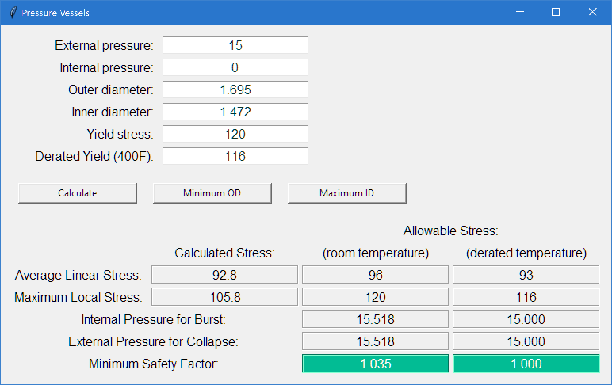

## Pressure Vessel stress calculator
Use this code to calculate the stresses in cylindrical pressure vessels. A 
calculator class, `Vessel`, and a GUI class, `PV_GUI`, are provided.

The calculator is intended for use with relatively simple pressure housings, 
without fittings, welds, or variations in material. For more complex vessels, 
the calculator may be used as a first step for the overall stress levels, to be 
followed by specific analysis of stress concentrations.

Given the dimensions of the pressure vessel, the material strength, and the 
applied pressure, the von Mises stresses in the wall are calculated. A safety 
factor is determined using both the maximum von Mises stress and the average 
stress between the inner and outer wall surface. The average stress is limited 
to a smaller proportion of the maximum allowable stress, which requires that 
vessels with thinner walls have larger margins of safety.
___
## Getting Started

### Prerequisites
* tkinter (included in Python Standard Library)

___
## Usage
For direct use of the `Vessel` class, you can import the module:
```python
from pressurevessels import Vessel
```
and create a `Vessel` instance:
```python
v = Vessel(pExt, pInt, OD, ID, yieldstress, deratedyieldstress)
```

To use the GUI from tkinter, you can execute the module with 
`python -m pressurevessels`

The GUI window resembles the following:


___
## Accessing the results
After creating a `Vessel` instance, the following calculated properties are available:

**Vessel.averagestress** : _The average of the inner and outer von Mises stresses_

**Vessel.maxstress** : The maximum von Mises stress

**Vessel.maxIntroom** : The maximum allowable internal pressure, such that the 
minimum safety factor is 1.0

**Vessel.maxExtroom** : The maximum allowable external pressure, such that the minimum safety factor is 1.0

**Vessel.maxIntderated** : The maximum allowable internal pressure for the 
derated temperature, such that the minimum safety factor is 1.0

**Vessel.maxExtderated** : The maximum allowable external pressure for the 
derated temperature, such that the minimum safety factor is 1.0

**Vessel.SF_room** : The safety factor for the vessel at room temperature (not 
derated)

**Vessel.SF_derated** : The safety factor for the vessel with the strength 
derated due to temperature

## Minimizing Wall Thickness
After creating a `Vessel` instance, the wall thickness can be minimized to 
reach a safety factor of 1.00, by modifying either the OD or ID.
* **Vessel.minimize_OD** : keeping the ID constant, set the OD to the smallest
value that results in a safety factor of 1.00
* **Vessel.maximize_ID** : keeping the OD constant, set the ID to the largest
value that results in a safety factor of 1.00
___
## Roadmap
* Unit conversions (US and SI)

## Contributing
Pull requests are welcome. For major changes, please open an issue first to discuss what you would like to change.

## License
[MIT](https://choosealicense.com/licenses/mit/)
